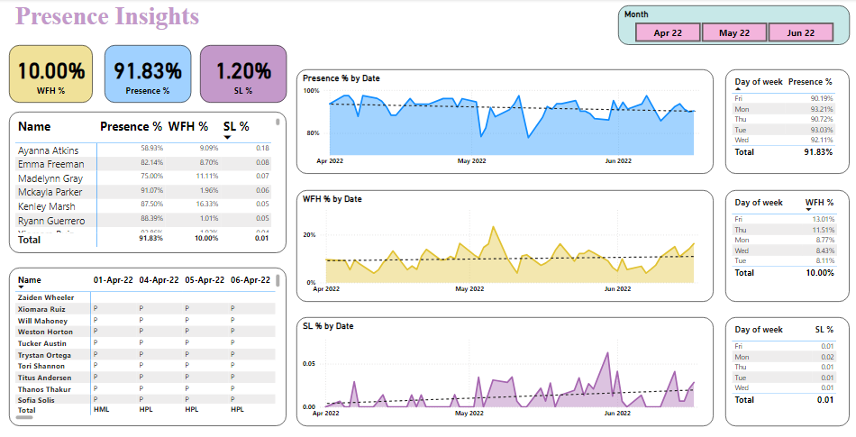

# HR Analytics Power BI Dashboard

## 📌 Project Overview
The **HR Analytics Power BI Dashboard** provides insights into employee attendance, leave trends, and workforce productivity. It helps HR professionals analyze attendance patterns, identify anomalies, and make data-driven decisions.

## 📂 Dataset Description
The dataset contains multiple sheets representing different months of attendance records, with details including:
- **Employee Code & Name**
- **Daily Attendance (Present, Leave, Work from Home, etc.)**
- **Leave Categories (Paid Leave, Sick Leave, Festival Leave, etc.)**
- **Weekly Offs & Holidays**

## 🔍 Key Business Questions Answered
1. What is the overall attendance trend for the year?
2. How many employees are consistently present or absent?
3. What is the most common leave type taken by employees?
4. Which department or team has the highest absenteeism?
5. How do work-from-home trends vary over time?
6. What is the distribution of paid vs. unpaid leaves?

## 📊 Power BI Dashboard Features
### 1️⃣ Attendance Trends
- **Daily, weekly, and monthly attendance patterns**
- **Comparison of present vs. absent employees**

### 2️⃣ Leave Analysis
- **Total leaves categorized by type (Sick Leave, Paid Leave, etc.)**
- **Employee-wise leave distribution**
- **Leave trends across different months**

### 3️⃣ Work from Home (WFH) Analysis
- **WFH trends across months and departments**
- **Comparison of WFH vs. in-office attendance**

## 📈 Key Insights Gained
- **Attendance Rate:** The average attendance rate across all employees is **91.83%**.
- **Most Common Leave Type:** **Sick Leave (SL)** was the most frequent leave type.
- **Highest Absenteeism Period:** The month of **May 22** showed the highest absenteeism rate.
- **Work from Home Trends:** The highest WFH requests were observed in **May 22**, aligning with seasonal trends.

## 🚀 Conclusion
This **HR Analytics Dashboard** provides valuable insights into workforce attendance patterns, leave trends, and productivity. It helps HR teams make data-driven decisions to improve employee engagement and workforce planning.

---
📌 **Author:** SyedNasirAliShah  
🔗 **GitHub Repository:**[HR Analytics Dashboard](https://github.com/SyedNasirAliShah/Data-Analysis-Projects)

