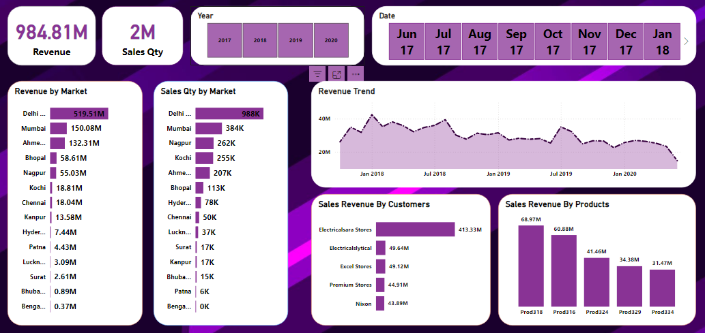

# Sales Insights Data Analysis



## Project Overview
The **Sales Insights Data Analysis** project is designed to analyze sales transactions using SQL queries. This project helps extract valuable business insights from sales data, including total revenue, market performance, and transactional anomalies.

## Technologies Used
- **SQL** for querying and analyzing sales data
- **Power BI** for data visualization and dashboard creation
- **Database** storing sales transactions and date-related data

## Dataset Description
The dataset consists of three primary tables:

### Transactions Table
Contains details of each sales transaction, including:
- Sales amount
- Product code
- Market code
- Order date
- Currency

### Date Table
Stores date attributes like:
- Year
- Month
- Date

### Customer Table

Stores the customer info

- name etc

## Key Queries and Analysis

### Total Sales in 2019
```sql
SELECT SUM(transactions.sales_amount) 
FROM transactions 
INNER JOIN date 
ON transactions.order_date = date.date 
WHERE date.year = 2019;
```

### Unique Products Sold in "Mark001" Market
```sql
SELECT COUNT(DISTINCT product_code) 
FROM transactions 
WHERE market_code = "Mark001";
```

### Transactions with Non-Positive Sales Amount
```sql
SELECT COUNT(sales_amount) AS transaction_count 
FROM sales.transactions 
WHERE sales_amount <= 0;
```

### Difference Between Total Transactions and Non-Positive Sales Transactions
```sql
SELECT 
    (SELECT COUNT(sales_amount) FROM sales.transactions) 
    -
    (SELECT COUNT(sales_amount) FROM sales.transactions WHERE sales_amount <= 0) 
    AS difference;
```

### Total Number of Transactions
```sql
SELECT COUNT(sales_amount) FROM sales.transactions;
```

### Identifying Currency Issues in Transactions
```sql
SELECT DISTINCT(transactions.currency) FROM transactions;
```
```sql
SELECT COUNT(transactions.sales_amount) FROM transactions WHERE transactions.currency = "INR\r";
```

### Total Revenue in 2019 (INR and USD Currencies)
```sql
SELECT SUM(transactions.sales_amount) 
FROM transactions 
INNER JOIN date ON transactions.order_date = date.date
WHERE date.year = 2019 
AND (transactions.currency = "INR\r" OR transactions.currency = "USD\r");
```

### Total Revenue in January 2020
```sql
SELECT SUM(transactions.sales_amount) 
FROM transactions 
INNER JOIN date ON transactions.order_date = date.date 
WHERE date.year = 2020 
AND date.month_name = "January" 
AND (transactions.currency = "INR\r" OR transactions.currency = "USD\r");
```

### Total Revenue for Chennai Market in 2020
```sql
SELECT SUM(transactions.sales_amount) 
FROM transactions 
INNER JOIN date ON transactions.order_date = date.date
WHERE date.year = 2020 
AND transactions.market_code = "Mark001";
```

## Power BI Dashboard
The Power BI dashboard provides:
- **Visual representation of total sales trends**
- **Market-wise sales analysis**
- **Sales Quantity**
- **Monthly revenue breakdown**
- **Revenue by market**

## Conclusion
This project enables effective sales insights, identifies potential data inconsistencies, and provides a foundation for business decision-making using Power BI and SQL-based analysis.

---
**Author:** SyedNasirAliShah  
**GitHub Repository:** [Sales Insights Data Analysis](https://github.com/SyedNasirAliShah/Data-Analysis-Projects)


